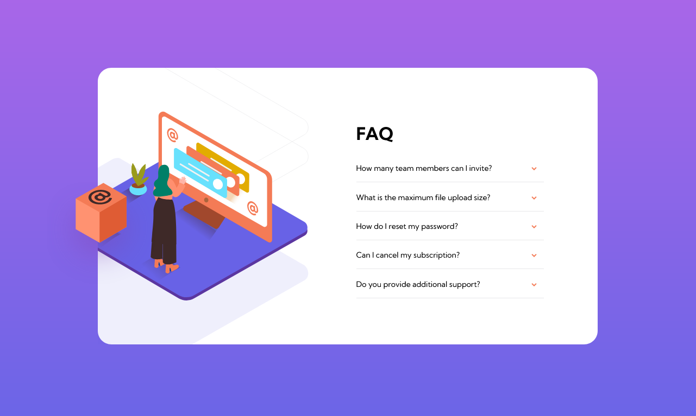

# Frontend Mentor - FAQ accordion card solution

This is a solution to the [FAQ accordion card challenge on Frontend Mentor](https://www.frontendmentor.io/challenges/faq-accordion-card-XlyjD0Oam). Frontend Mentor challenges help you improve your coding skills by building realistic projects.

## Table of contents

- [Overview](#overview)
  - [The challenge](#the-challenge)
  - [Screenshot](#screenshot)
  - [Links](#links)
- [My process](#my-process)
  - [Built with](#built-with)
  - [What I learned](#what-i-learned)
  - [Continued development](#continued-development)
  - [Useful resources](#useful-resources)
- [Author](#author)
- [Acknowledgments](#acknowledgments)

**Note: Delete this note and update the table of contents based on what sections you keep.**

## Overview

### The challenge

Users should be able to:

- View the optimal layout for the component depending on their device's screen size
- See hover states for all interactive elements on the page
- Hide/Show the answer to a question when the question is clicked

### Screenshot

### Links

- Solution URL: [https://github.com/aanacif/faqAccordionCard](https://github.com/aanacif/faqAccordionCard)
- Live Site URL: [https://aanacif.github.io/faqAccordionCard/](https://aanacif.github.io/faqAccordionCard/)

## My process

<code>
for (let coffee = 1; project != done; coffee++) {
  if (liquidDnBPlaylist) {
    return play
  }
}
<code>

### Built with

- Semantic HTML5 markup
- CSS custom properties
- Flexbox
- Pseudo elements and selectors
- Javascript

### What I learned

flexbox. rusty. Yep.

## Author

- Frontend Mentor - [@aanacif](https://www.frontendmentor.io/profile/aanacif)
- Twitter - [@aanacif](https://www.twitter.com/aanacif)

## Acknowledgments

frontendmentor FTW 👍
